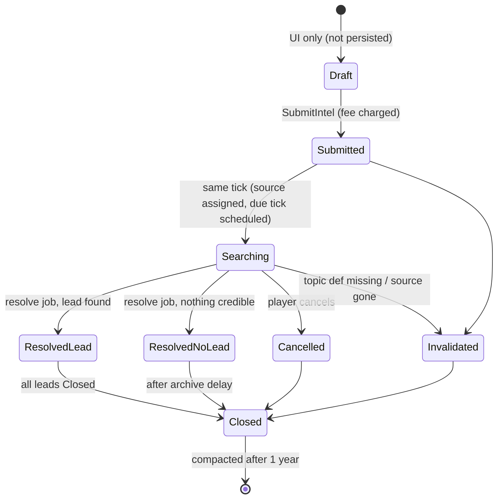
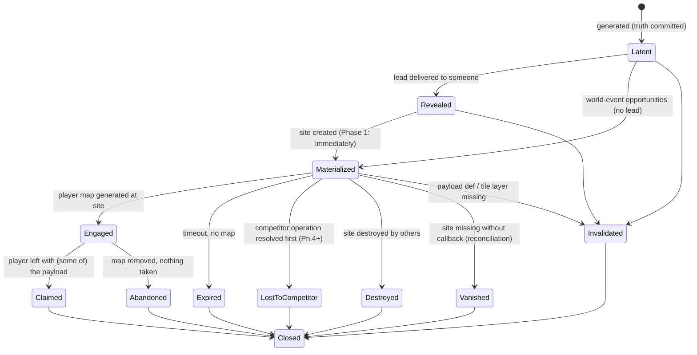
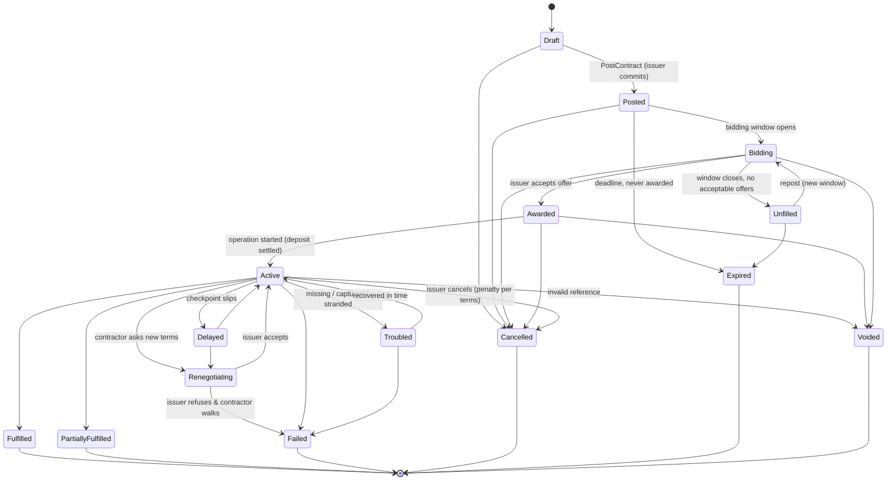
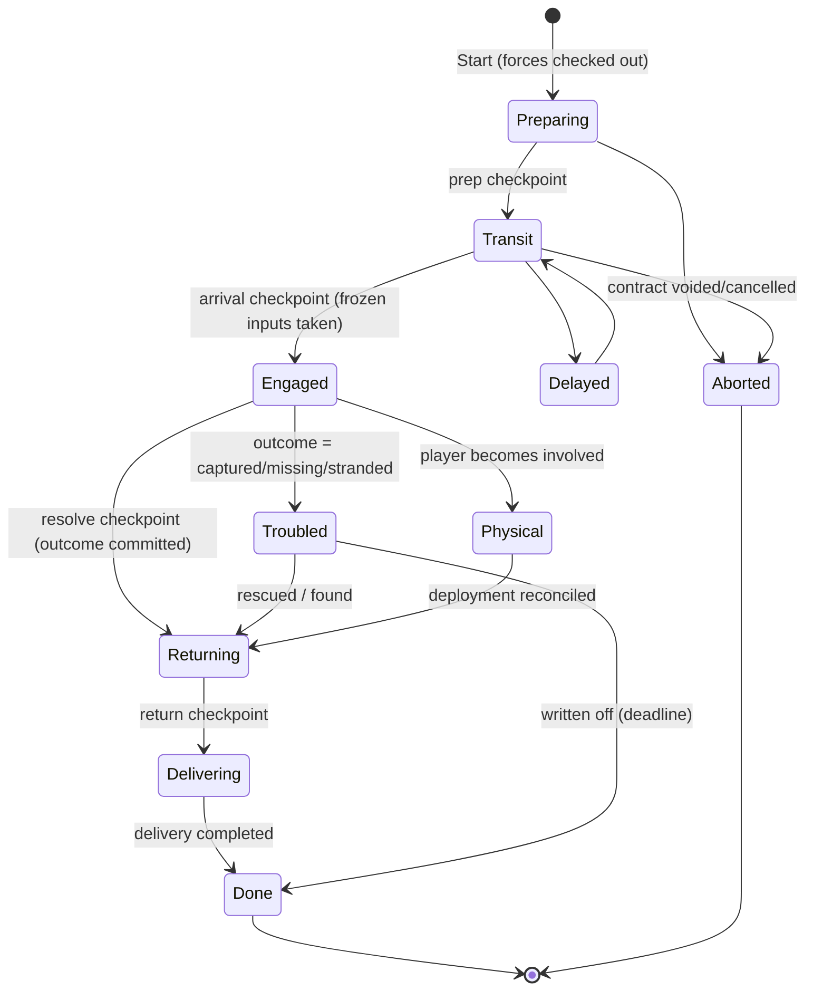
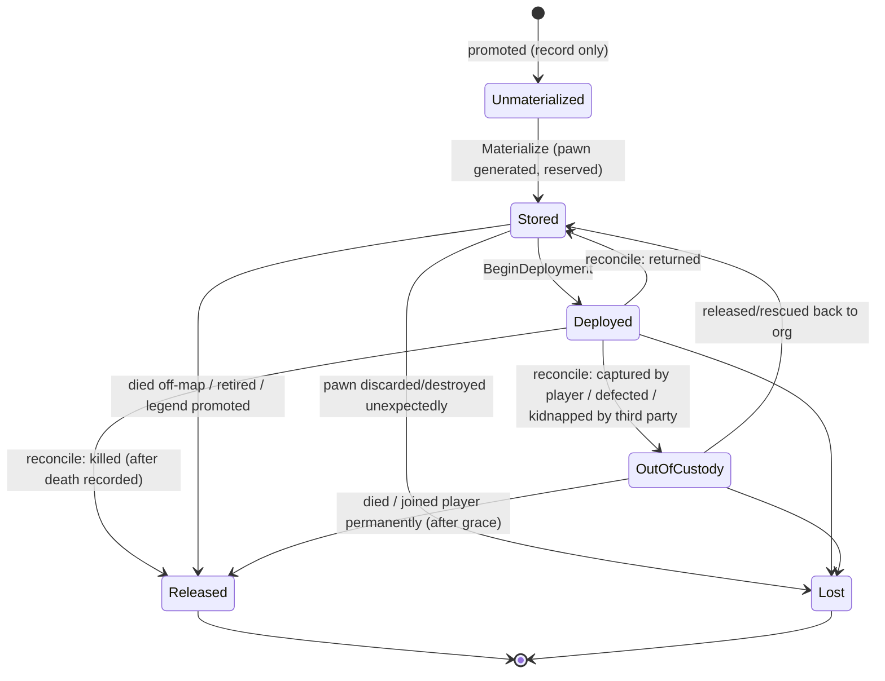
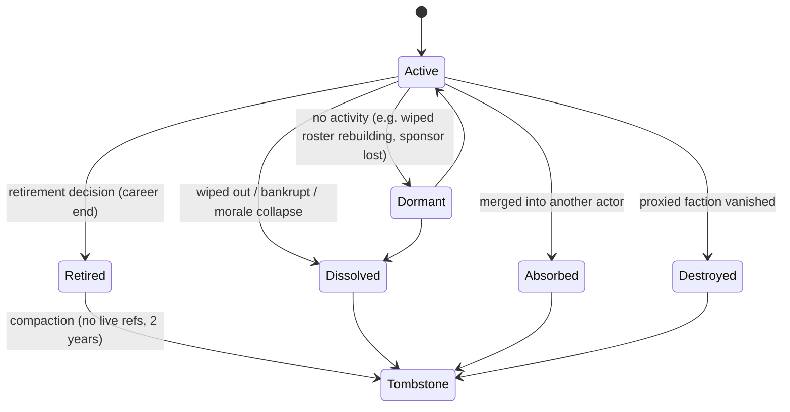

# State Machines

> Lifecycles of every stateful Network entity. The transition **tables** are normative. The
> diagrams are illustrations. Related: [DATA_MODEL](DATA_MODEL.md), [SIMULATION](SIMULATION.md),
> [ABSTRACT_PHYSICAL_LIFECYCLE](ABSTRACT_PHYSICAL_LIFECYCLE.md).

## Contents

0. [Rules common to every machine](#0-rules-common-to-every-machine)
1. [Intel request](#1-intel-request)
2. [Lead and Opportunity](#2-lead-and-opportunity)
3. [Contract (generic)](#3-contract-generic)
4. [Procurement (contract specialization)](#4-procurement-contract-specialization)
5. [Offer](#5-offer)
6. [Operation](#6-operation)
7. [Character custody](#7-character-custody)
8. [Deployment](#8-deployment)
9. [Actor lifecycle](#9-actor-lifecycle)
10. [Obligation](#10-obligation)

---

## 0. Rules common to every machine

1. **Transitions happen only in the owning service**, through one `Transition(entity, to, cause)`
   function per machine. That function checks the table, applies side effects, publishes the
   event and bumps `StateVersion`.
2. **Timers are scheduler jobs.** A state that waits for time stores the due tick on the entity
   *and* schedules a job. On load, the validator checks that the two agree and re-creates any
   missing job.
3. **Terminal states are immutable.** Continuation always creates a *new* entity linked by
   lineage.
4. **Invalidation from any non-terminal state.** Every machine has an `Invalidated` or `Voided`
   exit, taken when a required reference (Def, faction, tile, actor) can no longer be resolved.
   The exit settles money (refund policy) and emits an explanatory event and letter.
5. **Save and load at every state are safe by construction.** State is persisted, timers are
   re-validated, nothing is recomputed at load, and random results are committed on the entity
   ([SIMULATION § 6](SIMULATION.md#6-determinism-and-rng)).
6. **Quarantine** is outside every machine. A quarantined entity keeps its state but is skipped
   by the simulation until repaired by a migration or cleared with a dev action.

---

## 1. Intel request

The player's **interest**. It knows nothing about what exists in the world.

| From | Trigger | Guard | To | Side effects | Event |
|---|---|---|---|---|---|
| Draft | `SubmitIntel` | topic eligible; source active; `Payment.CanCharge(fee)` | Submitted | charge fee (ledger); seed = Hash(networkSeed, id) | `Intel.Requested` |
| Submitted | same tick | — | Searching | `dueTick = now + Duration(seed, rarity, sourceQuality)`; schedule `intel.resolve` | — |
| Searching | `intel.resolve` job | topic resolves; source not dissolved | ResolvedLead / ResolvedNoLead | commit `outcome`; on a lead: `Opportunities.Generate` → `Lead` → optionally `Materialize` | `Intel.Resolved` / `Intel.NoLead` |
| Searching | `CancelIntel` | — | Cancelled | refund per policy (default 50% if under half the search time has elapsed, else 0) | `Intel.Cancelled` |
| Submitted, Searching | validator / resolve-time check | `DefRef` missing, or source actor ended | Invalidated | full refund (the player did nothing wrong); explanatory letter | `Intel.Invalidated` |
| ResolvedLead | all leads Closed | — | Closed | — | — |
| ResolvedNoLead, Cancelled, Invalidated | 1-day archive job | — | Closed | — | — |

**Notes**

- `ResolvedNoLead` is a real, meaningful outcome ("the Exchange found nothing credible about
  Tenebrite"). It is recorded in the source's knowledge (`thing:X` experience +small) and in the
  player's summary. The design says failure should be meaningful, and this is the smallest
  example of it.
- Optional flavour: `Intel.SearchProgressed` updates at 1–2 seeded midpoints ("a contact in the
  south has heard something"). They are cosmetic and committed at submit time from the seed, so
  they never change the outcome.
- A request never holds "the loot". It holds `LeadId`s. What the lead points at is decided by
  the opportunity generator using world state at resolution.

---

## 2. Lead and Opportunity

### 2.1 Lead (perception)

| State | Meaning | Exits |
|---|---|---|
| `Active` | the player can act on it | → `Pursued` (player engaged the opportunity), → `Stale` (the opportunity expired or was lost, but the player has not been told), → `Closed` |
| `Pursued` | the player engaged | → `Closed` when the opportunity resolves |
| `Stale` | known to be outdated | → `Closed` after notice |
| `Closed` | archived | compacted with its request |

### 2.2 Opportunity (truth)

| From | Trigger | To | Side effects | Event |
|---|---|---|---|---|
| — | `Generate` | Latent | commit archetype, payload, location, threat, expiry (seeded) | `Opportunity.Generated` |
| Latent | lead created for an actor | Revealed | — | — |
| Revealed / Latent | `Materialize` | Materialized | `SiteAdapter.Create` (vanilla Site + parts + timeout + comp binding + quest tag); store `WorldObjectRef` | `Opportunity.Materialized` |
| Materialized | comp `PostMapGenerate` | Engaged | `firstEngagedTick`; Lead becomes Pursued | `Opportunity.Engaged` |
| Engaged | comp `PostCaravanFormed` | (same) | tally the payload def in the caravan into `playerClaimedCounts` | — |
| Engaged | comp `PostMyMapRemoved` | Claimed if tally > 0, else Abandoned | finalize; the site world object is usually removed by vanilla | `Opportunity.Claimed` / `.Abandoned` |
| Materialized | comp `PostDestroy` with no map ever | Expired (timeout passed) or Destroyed | — | `.Expired` / `.Destroyed` |
| Materialized | reconciliation: `WorldObjectRef` unresolvable | Vanished | treated like Destroyed; one info log | `.Destroyed` |
| any non-terminal | ref check | Invalidated | the site (if any) is left for vanilla to time out; explanatory letter | `.Invalidated` |
| terminal | 1-day job | Closed | Lead becomes Closed; the request may close | — |

**Claim accounting (Phase 1).** The count is approximate by design (*avoid false precision*):
the sum of the payload def carried out in caravans formed from the site map, plus a
**fallback sample** of how much payload remains on the map. The fallback is taken by a
low-frequency job, every 2,500 ticks, **only while that site map exists**. It covers departures
by transport pods, shuttles or gravships, which do not fire `PostCaravanFormed`. The history
text uses coarse phrases ("recovered most of the cache").

**Player settles the site** (`Notify_MyMapSettled`): the opportunity is treated as Claimed with
the remaining sampled amount, and the site becomes the player's.

---

## 3. Contract (generic)

**Terminal states:** Fulfilled, PartiallyFulfilled, Failed, Cancelled, Expired, Voided. They are
never reopened.

**Branching after a terminal state** (the Consequence Engine, or the issuer's decision) creates
a **new** contract with lineage:

| Situation | New contract | Lineage |
|---|---|---|
| Contractor failed or abandoned, and the objective is still wanted | *Repost* of the remaining objectives | `parent`, `root` |
| Another contractor offers to finish | *Inheritance*: the offer is created on the new contract | `inheritedFrom`, `parent` |
| Contractor org dissolved or absorbed, and its successor honours the obligation | *Successor inheritance* | `inheritedFrom`; contractor = successor |
| Contractors captured, missing or stranded | *Rescue / recovery* contract, plus an opportunity | `spawnedBy` = failure record |
| Cargo stolen | *Hunt / recovery* | `spawnedBy` |

`Troubled` is **not** terminal. It gives the story room to branch (a rescue can save the
contract) without forcing failure.

**Faction relation changes during an active contract** are handled by **checkpoint checks**,
not event subscriptions. At award, at each operation checkpoint, at delivery and at payment, the
contract re-checks the political conditions defined by its kind: the issuer is still
non-hostile to the contractor, the beneficiary is still reachable, the target faction still
exists. Failures route to `Renegotiating`, `Voided` (the issuer faction vanished) or `Failed`
(cause `PoliticalCollapse`) according to kind rules.

---

## 4. Procurement (contract specialization)

Procurement is a Contract whose kind is `Procurement` and whose objectives are
`Acquire(def, count)` plus `Deliver(destination)`. It is independent of Intel. The contractor's
own knowledge stands in for leads.

### 4.1 Lifecycle mapping

| Brief concept | Machine representation |
|---|---|
| draft · posted · accepting bids | `Draft` · `Posted` · `Bidding` |
| assigned | `Awarded` |
| preparing · active | `Active` with `Operation.phase = Preparing / Transit / Engaged` |
| delayed | `Delayed` |
| renegotiation | `Renegotiating` |
| missing · captured · stranded | `Troubled` + `Operation.status = Troubled(kind)` |
| catastrophic loss | `Operation.outcome.band = Disaster` → `Failed(cause=CatastrophicLoss)` |
| fraud / betrayal | `Failed(cause=Fraud)` or `Failed(cause=Betrayal)`; history Major; relations; gossip |
| partial success | `PartiallyFulfilled` |
| success | `Fulfilled` |
| failed | `Failed(cause)` |
| recovery opportunity · continuation | new Opportunity or Contract through lineage (§ 3) |
| completed / closed | terminal state, then compaction after 1 year |

### 4.2 Money rules

| Moment | Rule |
|---|---|
| **Award** | Deposit charged (`Payment.Charge`). If the player cannot pay, the award is refused with reason `CannotAffordDeposit`. |
| **Delivery (full)** | Balance charged. If the player cannot pay, `Payment.Defaulted`: the contractor applies its doctrine (§ 4.3). |
| **Partial delivery** | Balance is pro-rated by delivered/required, minus penalties from the terms. Insurance can refund part of the deposit for the undelivered portion. |
| **Cancellation by issuer** | Before award: free. After award, before Engaged: the deposit is forfeited. After Engaged: deposit forfeited plus a kind-defined penalty (can become a debt obligation). |
| **Contractor wiped out or dead** | `Failed(ContractorWipedOut)`. Insurance pays out per coverage. The deposit is refunded when the contractor is dissolved (there is nobody to keep it), otherwise it is forfeit. |
| **Fraud** | Deposit lost. Relation and sanction consequences. Possible hunt follow-up. |
| **Voided (item Def removed)** | Full deposit refund (by drop pod to a player home map, or held as a credit obligation if no home map exists). The history record keeps the snapshot label. |

### 4.3 Player bankruptcy (cannot pay the balance)

`Payment.Defaulted` → the contractor decides using doctrine (greed, loyalty, professionalism)
and the relation edge:

- **Hold goods**: the contract stays `Active`, with sub-status `AwaitingPayment` and a grace
  timer (a scheduler job). The player can pay later.
- **Partial handover**: deliver the goods covered by what was paid so far, then
  `PartiallyFulfilled`.
- **Debt**: deliver in full and create an `Obligation(debt.silver)` against the player.
  Trust falls. Defaulting on the debt later becomes a Major record.
- **Hostile** (Phase 5+, criminal doctrine only): a follow-up "debt collection" opportunity is
  created. It is never an instant raid.

### 4.4 Destination and map destruction

`DeliverObjective.destination = DeliveryTarget { preferred: MapRef, fallback: AnyPlayerHome | Hold }`.

- The preferred map is gone (abandoned or destroyed): the delivery goes to another player home
  map, if one exists.
- There is no home map at all (a nomad caravan game): the delivery waits `Hold` for up to 15
  days, with a letter. **Later phases:** delivery to a caravan through a meeting opportunity.
- The delivery drop fails (no valid drop spot): retry each day up to 3 times, then `Hold` with a
  letter.

### 4.5 Save and load at every stage

| Stage | What is persisted | What happens after load |
|---|---|---|
| Draft (UI) | nothing (drafts are UI-only) | lost; acceptable |
| Posted / Bidding | contract, offers, window job | the validator re-creates any missing window job |
| Awarded / Active | contract, operation, checkpoint jobs, seed, frozen inputs (once taken) | checkpoints fire at the same ticks, with the same seed and inputs, and give the same outcome |
| Physical delivery in progress | deployment + pawns (vanilla-saved) + drop pods (vanilla-saved) | reconciliation on the first tick (see [ABSTRACT_PHYSICAL_LIFECYCLE § 6](ABSTRACT_PHYSICAL_LIFECYCLE.md#6-save-and-load-while-physical)) |
| Terminal | outcome + ledger | nothing to do |

### 4.6 Mod removal

The acquire objective's `DefRef` does not resolve, so the validator raises `Reference.Invalidated`
and the contract becomes `Voided(DefMissing)` with a refund. If an operation is running, it is
aborted and its forces are returned to the roster with no casualties. History keeps
"3× Tenebrite (removed mod)".

---

## 5. Offer

| From | Trigger | To |
|---|---|---|
| — | `Bidding.CollectOffers` (willingness says yes) | Proposed |
| Proposed | issuer accepts | Accepted (other offers become Superseded) |
| Proposed | issuer declines | Declined |
| Proposed | bidder's state changes (overcommitted, morale collapse, relation break) | Withdrawn |
| Proposed | `expiresTick` passes | Expired |

A refusal is **not** an offer. It is recorded in `Contract.refusals` with reason keys
([SIMULATION § 5](SIMULATION.md#5-willingness-refusal-and-bidding)). The UI shows it as flavour
("The Ashen Coil: too dangerous; you still owe us").

---

## 6. Operation

- **Outcome commitment.** At the `Engaged → resolve` checkpoint the resolver runs **once**. The
  outcome (band, amounts, casualties, fates, delay) is written to `Operation.outcome` and all
  consequences are published. Later checkpoints only *apply* the outcome (delay, return,
  delivery). They never re-resolve.
- **Aborted** returns the checked-out forces unharmed and releases leases.
- **Physical**: see [ABSTRACT_PHYSICAL_LIFECYCLE](ABSTRACT_PHYSICAL_LIFECYCLE.md).

---

## 7. Character custody

Custody describes **who controls the pawn** (if one exists). It is separate from status (alive,
dead, captured, …).

| State | Pawn exists? | Network reserves pawn? | Who ticks it |
|---|---|---|---|
| Unmaterialized | no | — | nobody |
| Stored | yes (world pawn) | **yes** (registry quest reservation, which makes it suspended) | vanilla, but suspended (needs, health and age are skipped); mothballed once healthy after store-time normalization |
| Deployed | yes (on a map, in a site part, in a caravan or pod) | yes (it keeps the reservation while not spawned) | vanilla |
| OutOfCustody | yes (prisoner, colonist, kidnapped, other faction) | **no** | vanilla |
| Released | maybe (the corpse or pawn is handed to vanilla) | no | vanilla (GC decides) |
| Lost | no, or the pointer is invalid | no | — |

Invariants and transition details: [ABSTRACT_PHYSICAL_LIFECYCLE § 3–5](ABSTRACT_PHYSICAL_LIFECYCLE.md#3-invariants).

---

## 8. Deployment

| State | Meaning | Exit |
|---|---|---|
| Planned | forces and characters chosen; pawns not yet created | → Materialized |
| Materialized | pawns exist (generated or unstored) but are not spawned; they may sit in a `SitePart.things` holder or be waiting for a drop | → Active (first pawn spawned), → Reconciling (the anchor site was destroyed first) |
| Active | at least one entry spawned or travelling | → Reconciling on: anchor map removed, all entries left the map, the encounter-end signal, or a watchdog job (every 2,500 ticks while Active) that finds no entry spawned |
| Reconciling | fates being determined per entry | → Closed (all entries have a non-Pending fate other than StillDeployed) |
| Closed | roster, leases and characters updated; events published | — |

---

## 9. Actor lifecycle

- **Fragmentation** does **not** end the parent by itself. The parent may continue with a reduced
  roster, or dissolve. Each splinter is a *new* Active actor with `lineage.splitFrom`.
- **Mergers** create a new actor, or keep the dominant one. The others become `Absorbed`.
- **Retirement transformation** ([SIMULATION § 4.6](SIMULATION.md#46-retirement-transformation-fragmentation-mergers)):
  the org becomes `Retired`. Selected characters may *embody* new `Individual` actors with
  `IntelSourceProfile`, `IntroducerProfile` or `TraderProfile`, and inherit knowledge.
- A **Tombstone** keeps the ID, name, kind, dates, fate and legend link forever.

---

## 10. Obligation

| From | Trigger | To |
|---|---|---|
| — | an event rule (rescue, a favour done, debt created) | Open |
| Open | creditor calls it in (a command, or the bidding or introduction logic) | Called |
| Called | debtor complies (discount applied, help given, introduction made) | Honored |
| Called | debtor refuses or cannot (its doctrine and state) | Defaulted (Major if the magnitude is large) |
| Open | creditor forgives (a gift, or relationship logic) | Forgiven |
| Open | `expiresTick` passes | Expired |

Obligations never move silver on their own. `debt.silver` is settled through `PaymentAdapter`
like any other payment, and recorded in the ledger.
