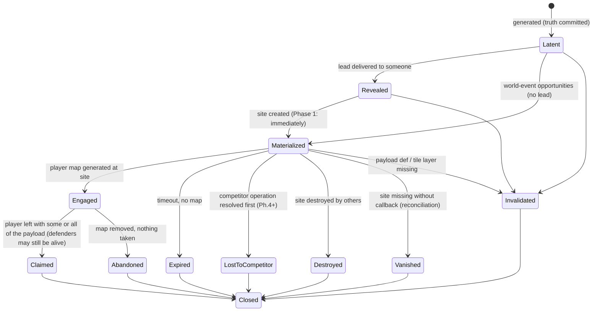
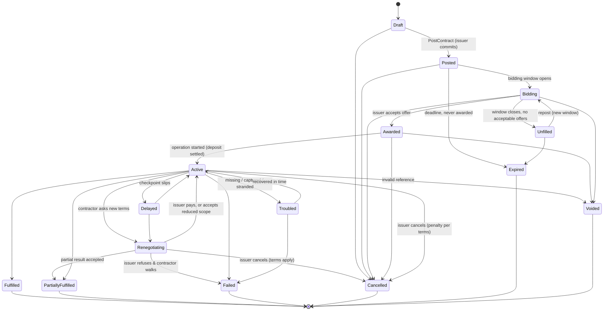
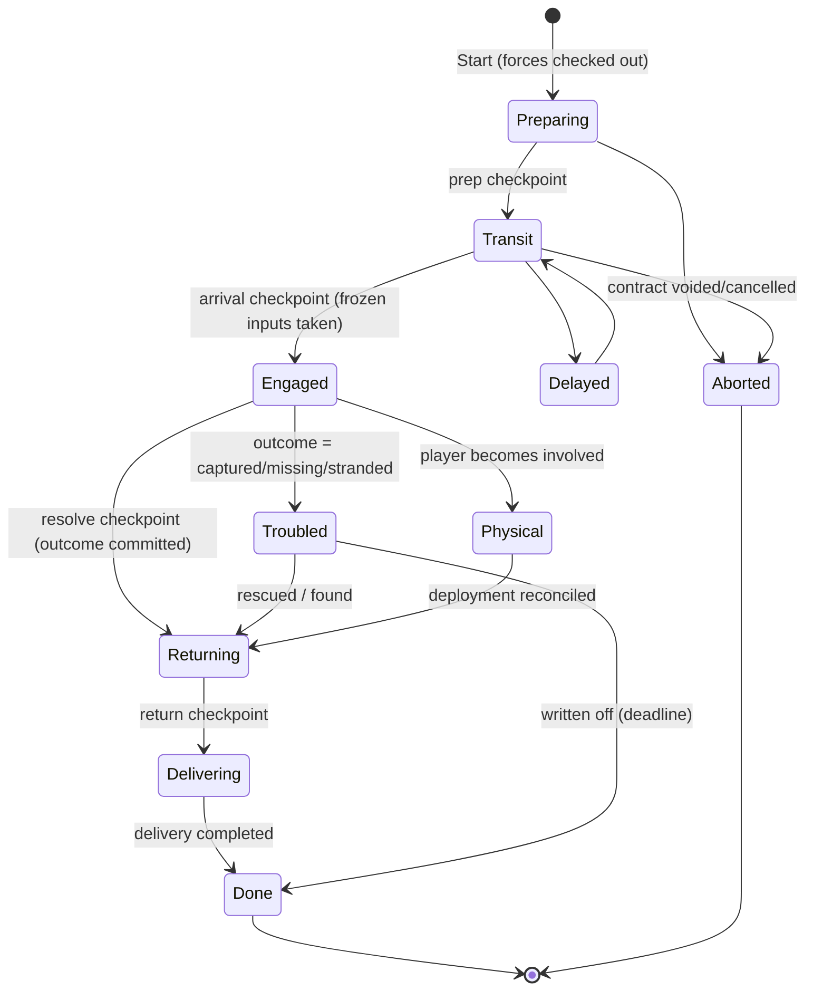
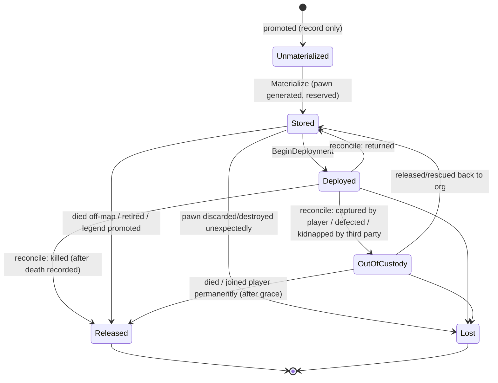
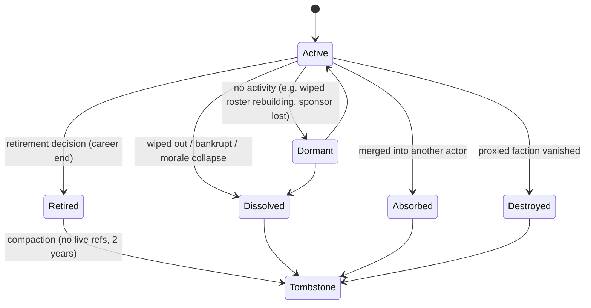

# State Machines

> Lifecycles of every stateful Network entity. The transition **tables** are normative. The
> diagrams are illustrations. Related: [DATA_MODEL](DATA_MODEL.md), [SIMULATION](SIMULATION.md),
> [ABSTRACT_PHYSICAL_LIFECYCLE](ABSTRACT_PHYSICAL_LIFECYCLE.md).

## Contents

0. [Rules common to every machine](#0-rules-common-to-every-machine)
1. [Intel request](#1-intel-request)
2. [Lead and Opportunity](#2-lead-and-opportunity)
3. [Contract (generic)](#3-contract-generic)
4. [Procurement (contract specialization)](#4-procurement-contract-specialization)
5. [Offer](#5-offer)
6. [Operation](#6-operation)
7. [Character custody](#7-character-custody)
8. [Deployment](#8-deployment)
9. [Actor lifecycle](#9-actor-lifecycle)
10. [Obligation](#10-obligation)

---

## 0. Rules common to every machine

1. **Transitions happen only in the owning service**, through one `Transition(entity, to, cause)`
   function per machine. That function checks the table, applies side effects, publishes the
   event and bumps `StateVersion`.
2. **Timers are scheduler jobs.** A state that waits for time stores the due tick on the entity
   *and* schedules a job. On load, the validator checks that the two agree and re-creates any
   missing job.
3. **Terminal states are immutable.** Continuation always creates a *new* entity linked by
   lineage.
4. **Invalidation from any non-terminal state.** Every machine has an `Invalidated` or `Voided`
   exit, taken when a required reference (Def, faction, tile, actor) can no longer be resolved.
   The exit settles money (refund policy) and emits an explanatory event and letter.
5. **Save and load at every state are safe by construction.** State is persisted, timers are
   re-validated, nothing is recomputed at load, and random results are committed on the entity
   ([SIMULATION § 6](SIMULATION.md#6-determinism-and-rng)).
6. **Quarantine** is outside every machine. A quarantined entity keeps its state but is skipped
   by the simulation until repaired by a migration or cleared with a dev action.

---

## 1. Intel request

The player's **interest**: an item topic and the contact asked, never a quantity. It knows
nothing about what exists in the world. **One request can produce zero, one or many leads**: a
search runs in rounds, and the same request can keep searching after a lead (master § 11).

```mermaid
stateDiagram-v2
  [*] --> Draft : UI only (not persisted)
  Draft --> Submitted : SubmitIntel (comms available, fee per source policy)
  Submitted --> Searching : same tick (round 1 scheduled)
  Searching --> Searching : round ends; policy keeps searching (with or without a lead)
  Searching --> AwaitingDecision : round delivered a lead; policy asks the player
  AwaitingDecision --> Searching : ContinueIntel (continuation terms per source policy)
  AwaitingDecision --> Concluded : EndIntel (player stops the search)
  Searching --> Concluded : policy ends the search (round limit, or nothing credible found)
  Searching --> Cancelled : CancelIntel (player stops a running round)
  Submitted --> Invalidated
  Searching --> Invalidated : topic def missing / source gone
  AwaitingDecision --> Invalidated
  Concluded --> Closed : all leads Closed, after archive delay
  Cancelled --> Closed
  Invalidated --> Closed
  Closed --> [*] : compacted after 1 year
```

| From | Trigger | Guard | To | Side effects | Event |
|---|---|---|---|---|---|
| Draft | `SubmitIntel` | a usable Comms Console (ARCHITECTURE § 9); topic eligible; source active and contactable (a Fixer, a non-hostile faction contact, the Exchange); `Payment.CanCharge(fee)` | Submitted | freeze the source's `SearchTerms`; charge the fee its policy sets (ledger); seed = Hash(networkSeed, id). Nothing about quantity is taken or stored. | `Intel.Requested` |
| Submitted | same tick | — | Searching | `round = 1`; `nextRoundDueTick = now + RoundDuration(...)`; schedule `intel.round` | — |
| Searching | `intel.round` job | topic resolves; source not ended | Searching, AwaitingDecision or Concluded | draw from `NetRng(seed, "intel.round", round)`. **Lead:** commit the hidden divergence class, `Opportunities.Generate` (the source resolver may still find no credible source), append the `Lead`, optionally `Materialize`. **Then the continuation policy decides:** keep searching (schedule the next round, charging whatever the policy charges), ask the player (AwaitingDecision), or end (Concluded: round limit, or nothing credible found). Fees already paid are kept for rounds that ran. | `Intel.LeadDelivered` / `Intel.NoLead` (a round with nothing) / `Intel.Concluded` |
| AwaitingDecision | `ContinueIntel` | a usable Comms Console; `Payment.CanCharge(continuation terms)` | Searching | `round++`; charge per policy (which may be nothing); schedule the next round | `Intel.SearchContinued` |
| AwaitingDecision | `EndIntel` | a usable Comms Console | Concluded | — | `Intel.Concluded` |
| Searching | `CancelIntel` | a usable Comms Console | Cancelled | cancel the running round's job; refund per the source's fee policy (for example part of that round's fee early in the round) | `Intel.Cancelled` |
| Submitted, Searching, AwaitingDecision | validator / round-time check | `DefRef` missing, or source actor ended | Invalidated | refund the running round's fee in full (the player did nothing wrong); explanatory letter | `Intel.Invalidated` |
| Concluded, Cancelled, Invalidated | every lead Closed, then a 1-day archive job | — | Closed | — | — |

**Round duration** is not a global constant. It comes from the source's `speedBand`,
specialties and topic knowledge, geography, the target's difficulty and rarity, the player's
relationship with the source, the source's reputation, and seeded variance. The formula is
replaceable and not fixed here. Duration and every draw are committed per round, so reloading
never rerolls.

**Continuation policy** belongs to the source (the Fixer's `continuationPolicyKey`, frozen into
the request's terms): searching on under the original fee, a fee per round, a reduced
continuation fee, a round limit, or a service package. The machine supports all of them; none is
hardcoded.

**Notes**

- Leads are independent entities. Pursuing, ignoring or abandoning Lead A **does not stop the
  search**: the player can be at the site from Lead A while the Fixer keeps looking and later
  delivers Lead B, if the policy continues. Abandoning a lead closes that lead only; ending the
  search is `EndIntel`.
- A search that ends with **no leads at all** is a real, meaningful outcome ("your contact found
  nothing credible about Tenebrite"). It is recorded in the source's knowledge (`thing:X`
  experience +small) and in the player's summary, and the fee is kept.
- `AwaitingDecision` has no timer and needs no console to persist: the search simply waits. Only
  the player's replies need communications.
- Optional flavour: `Intel.SearchProgressed` updates at seeded midpoints of a round ("a contact
  in the south has heard something"). They are cosmetic and committed when the round starts, so
  they never change the outcome.
- A request never holds "the loot". It holds `LeadId`s. What each lead points at, and how much
  of the item exists there, is decided by the opportunity generator using world state at that
  round. A lead is never guaranteed to be accurate (master § 12).

---

## 2. Lead and Opportunity

### 2.1 Lead (perception)

| State | Meaning | Exits |
|---|---|---|
| `Active` | the player can act on it | → `Pursued` (player engaged the opportunity), → `Stale` (the opportunity expired or was lost, but the player has not been told), → `Closed` |
| `Pursued` | the player engaged | → `Closed` when the opportunity resolves |
| `Stale` | known to be outdated | → `Closed` after notice |
| `Closed` | archived | compacted with its request |

### 2.2 Opportunity (truth)

| From | Trigger | To | Side effects | Event |
|---|---|---|---|---|
| — | `Generate` | Latent | commit archetype, payload, location, threat, expiry (seeded) | `Opportunity.Generated` |
| Latent | lead created for an actor | Revealed | — | — |
| Revealed / Latent | `Materialize` | Materialized | `SiteAdapter.Create` (vanilla Site + parts + timeout + comp binding + quest tag); store `WorldObjectRef` | `Opportunity.Materialized` |
| Materialized | comp `PostMapGenerate` | Engaged | `firstEngagedTick`; Lead becomes Pursued | `Opportunity.Engaged` |
| Engaged | comp `PostCaravanFormed` | (same) | re-sample the site map (the caravan's pawns have already exited); the caravan's own count is a diagnostic only | — |
| Engaged | comp pre-removal check (`CompTickInterval` when `ShouldRemoveMapNow` is true) | (same) | final sample of the site map | — |
| Engaged | comp `PostMyMapRemoved` | Claimed if recovered > 0, else Abandoned | recovered = site stock at map generation − last sample, capped at the target; finalize `recoveredBand`; the site world object is usually removed by vanilla | `Opportunity.Claimed` / `.Abandoned` |
| Materialized | comp `PostDestroy` with no map ever | Expired (timeout passed) or Destroyed | — | `.Expired` / `.Destroyed` |
| Materialized | reconciliation: `WorldObjectRef` unresolvable | Vanished | treated like Destroyed; one info log | `.Destroyed` |
| any non-terminal | ref check | Invalidated | the site (if any) is left for vanilla to time out; explanatory letter | `.Invalidated` |
| terminal | 1-day job | Closed | Lead becomes Closed; the request may close | — |

**Acquisition, not extermination.** No transition waits for the defenders to die. Taking only
part of the target payload and leaving with defenders still alive is `Claimed` with a partial
`recoveredBand`, and history records a partial recovery, not a defeat. Arriving, judging the site
too dangerous and leaving empty-handed is `Abandoned`. Whether the chosen vanilla site
composition really permits this (the caravan or pods can leave, recovered items stay recovered,
nothing duplicates, cleanup is sane) is Spike S19. If it does not, the fix is a different vanilla
composition or a minimal Network site part, not a change to this machine.

**Claim accounting (Phase 1).** The count is approximate by design (*avoid false precision*),
but its provenance is not: **items the player brought into the site map never count as recovered
payload.** Recovery is the depletion of the site's own stock: the payload def on the map at
`PostMapGenerate` (which vanilla runs before the arriving caravan or pods put anything on the map)
minus what the last sample still finds there, capped at the committed target. Samples count
everything of the def on the map; they are taken after each caravan departure, by a low-frequency
job every 2,500 ticks **only while that site map exists**, and once more right before vanilla
removes the map (the comp's `CompTickInterval` runs just before `CheckRemoveMapNow` in the same
call), which covers departures by transport pods or shuttles. What the player carries out is never
added up, so the player's own copies can only lower the estimate, pod cargo cannot be counted
twice, and items that come back onto the map are not counted again. The history text uses coarse
phrases ("recovered part of the cache", "recovered most of the cache"). See
[S19](spikes/S19-loot-without-extermination.md) for the limitations (all under-counts).

**Player settles the site** (`Notify_MyMapSettled`, observed through the site's `MapSettled`
quest-tag signal because the comp hook is not virtual): the opportunity is treated as Claimed with
the remaining sampled amount, and the site becomes the player's.

---

## 3. Contract (generic)

**Terminal states:** Fulfilled, PartiallyFulfilled, Failed, Cancelled, Expired, Voided. They are
never reopened.

**Branching after a terminal state** (the Consequence Engine, or the issuer's decision) creates
a **new** contract with lineage:

| Situation | New contract | Lineage |
|---|---|---|
| Contractor failed or abandoned, and the objective is still wanted | *Repost* of the remaining objectives | `parent`, `root` |
| Another contractor offers to finish | *Inheritance*: the offer is created on the new contract | `inheritedFrom`, `parent` |
| Contractor org dissolved or absorbed, and its successor honours the obligation | *Successor inheritance* | `inheritedFrom`; contractor = successor |
| Contractors captured, missing or stranded | *Rescue / recovery* contract, plus an opportunity | `spawnedBy` = failure record |
| Cargo stolen | *Hunt / recovery* | `spawnedBy` |

`Troubled` is **not** terminal. It gives the story room to branch (a rescue can save the
contract) without forcing failure.

**Renegotiation and partial results are the client's choice** (master § 23). When a contractor
reports "much worse than expected", the issuer may pay more, refuse, cancel or accept a reduced
scope. When a contractor brings back only part of the goods, the contract waits in
`Renegotiating` (reason `PartialResult`) for the issuer to accept the partial delivery at an
adjusted price (→ `PartiallyFulfilled`), accept it and request continuation (→
`PartiallyFulfilled` plus a linked continuation contract for the remainder), or renegotiate. NPC
issuers decide through their own logic. A grace timer applies a kind-defined default if the
player does not answer.

**Faction relation changes during an active contract** are handled by **checkpoint checks**,
not event subscriptions. At award, at each operation checkpoint, at delivery and at payment, the
contract re-checks the political conditions defined by its kind: the issuer is still
non-hostile to the contractor, the beneficiary is still reachable, the target faction still
exists. Failures route to `Renegotiating`, `Voided` (the issuer faction vanished) or `Failed`
(cause `PoliticalCollapse`) according to kind rules.

---

## 4. Procurement (contract specialization)

Procurement is a Contract whose kind is `Procurement` and whose objectives are
`Acquire(def, count)` plus `Deliver(destination)`. It is independent of Intel. The contractor's
own knowledge stands in for leads. From Phase 2 it is normally **brokered by a Fixer**
(`parties.broker`): the client asks the Fixer, contractors bid, and the Fixer turns each bid into
one client-facing quote ([DATA_MODEL § 9](DATA_MODEL.md#9-contracts)).

### 4.1 Lifecycle mapping

| Concept (Phase 0 brief, master § 22–24) | Machine representation |
|---|---|
| draft · posted · accepting bids | `Draft` · `Posted` · `Bidding` |
| open contract (any eligible contractor) | `parties.invited` empty; bidding among eligible contractors, and the population manager may introduce a new group as a bidder (master § 64) |
| direct contract (hire a known group) | `parties.invited = [group]`; only invited actors are evaluated |
| premium / sponsored contract | open or direct, plus `terms.contributions` (silver, or items as leases) feeding the resolver's sponsorship input |
| quote | each `Offer` carries a `ProcurementQuote` assembled by the broker (contractor components + Fixer components, one final price, payment terms, optional insurance, validity); accepting the quote accepts the offer and copies its terms into the contract |
| assigned | `Awarded` |
| preparing · active | `Active` with `Operation.phase = Preparing / Transit / Engaged` |
| delayed | `Delayed` |
| renegotiation | `Renegotiating` |
| missing · captured · stranded | `Troubled` + `Operation.status = Troubled(kind)` |
| catastrophic loss | `Operation.outcome.band = Disaster` → `Failed(cause=CatastrophicLoss)`; a battle site / last known location may follow |
| fraud / betrayal | `Failed(cause=Fraud)` or `Failed(cause=Betrayal)`; history Major; relations; gossip |
| partial success | `Renegotiating(PartialResult)`, then `PartiallyFulfilled` (± a continuation contract) by the client's choice (§ 3) |
| success | `Fulfilled` |
| failed | `Failed(cause)` |
| recovery opportunity · continuation | new Opportunity or Contract through lineage (§ 3) |
| completed / closed | terminal state, then compaction after 1 year |

### 4.2 Money rules

The deposit is **committed cost**, not escrow: preparation, logistics, transport, scouting,
equipment, supplies, labour and accepted risk. Failure must hurt (master § 21, § 23, § 61).
Its share and schedule come from the brokering **Fixer's deposit policy** (master § 21 suggests
half on award, half on delivery); terms may vary it. Exact percentages are tuning.

| Moment | Rule |
|---|---|
| **Award** | Deposit charged (`Payment.Charge`). If the player cannot pay, the award is refused with reason `CannotAffordDeposit`. |
| **Delivery (full)** | Balance charged. If the player cannot pay, `Payment.Defaulted`: the contractor applies its doctrine (§ 4.3). |
| **Partial delivery** | By the client's choice (§ 3): the balance is pro-rated by delivered/required, minus penalties from the terms. Insurance can recover part of the deposit for the undelivered portion. |
| **Mission failure, including catastrophic loss** (contractor wiped out, dead, retreated with nothing) | `Failed(cause)`. **The deposit is normally lost.** Insurance recovers part of it per coverage. Failure also feeds consequences (a last known location, a rescue, a battle site), not a refund. |
| **Fraud / betrayal** | `Failed(Fraud / Betrayal)`. **Deposit lost**, unless later gameplay recovers it (a hunt or recovery follow-up can return money or cargo). Relation and sanction consequences. Insurance applies only as its terms say. |
| **Contractor disappears before work starts** (dies, dissolves, is absorbed or vanishes while `Awarded`, before its operation reaches Engaged) | **No global rule.** The brokering Fixer mediates it through its `replacementPolicyKey` and the terms. Possible results: a successor honours the contract (successor inheritance, § 3), the Fixer provides a replacement contractor, a full or partial refund, account credit (`credit.account`), an insurance claim, a renegotiated contract, or the deposit forfeited. The choice may depend on Fixer policy, contract terms, the relationship, insurance, whether preparation costs were actually committed, and whether the failure was genuine, fraudulent or technical. Technical invalidation (below) still protects the player in full. |
| **Cancellation by issuer** | Before award: free. After award (commitment), the deposit is **partly or fully forfeited according to the terms** (`refundPolicyKey`); after Engaged, a kind-defined penalty may be added (it can become a debt obligation). |
| **Technical invalidation** (item Def removed, the requested mod gone, the Network can no longer legally execute the contract, the save is prepared for removal) | `Voided`. **Full deposit refund**, because this is not an in-world failure (by drop pod to a player home map, or held as a credit obligation if no home map exists). The history record keeps the snapshot label. |
| **Insurance** (optional, master § 62) | Offered by the brokering Fixer (premium and coverage from its insurance policy). A premium buys partial recovery of the deposit on covered failures. `coverage < 1`: it never makes a contract risk-free. |

**Replacement accounting (Phase 2).** When the Fixer finds a replacement, the parent closes
(`Failed(PreWorkLoss)`) and a NEW linked contract takes over. The parent's remaining funding moves to
the child as a transfer, purpose by purpose (deposit, premium, insurance premium with the inherited
insurance terms, any paid renegotiation). No silver moves and no second deposit is charged. The
parent then holds nothing refundable; the child treats the carried funding as its own for every rule
in this table. A chain A → B → C transfers twice and charges once
([DATA_MODEL § 16.1](DATA_MODEL.md#161-phase-2-contract-ledger-implemented), ADR-038).

### 4.3 Player bankruptcy (cannot pay the balance)

`Payment.Defaulted` → the contractor decides using doctrine (greed, loyalty, professionalism)
and the relation edge:

- **Hold goods**: the contract stays `Active`, with sub-status `AwaitingPayment` and a grace
  timer (a scheduler job). The player can pay later.
- **Partial handover**: deliver the goods covered by what was paid so far, then
  `PartiallyFulfilled`.
- **Debt**: deliver in full and create an `Obligation(debt.silver)` against the player.
  Trust falls. Defaulting on the debt later becomes a Major record.
- **Hostile** (Phase 5+, criminal doctrine only): a follow-up "debt collection" opportunity is
  created. It is never an instant raid.

**Phase 2 as implemented.** Only the Hold and partial-handover branches exist. The contractor's
professionalism, loyalty, greed and trust in the client decide: a high score hands over at once;
otherwise it holds for a 7-day grace period (the client can pay the balance any time), then hands
over what the deposit covered. The debt branch waits for Obligations (Phase 5).

**Grace defaults (Phase 2, `NetworkContractKindDef` tuning).**

| Waiting on the client | Grace | Default |
|---|---|---|
| `Renegotiating(WorseThanExpected)` | 3 days | accept the reduced scope |
| `Renegotiating(PartialResult)` | 5 days | accept the partial result at a pro-rated price |
| `AwaitingPayment` | 7 days | partial handover |
| Delivery `Hold` | daily retries, 15 days | `Failed(UndeliverableNoHome)`, paid balance refunded |
| `Troubled` | 10 days | the group turns up (seeded), or `Failed(ContractorLost)` |
| `Unfilled` | 10 days | `Expired` |

### 4.4 Destination and map destruction

`DeliverObjective.destination = DeliveryTarget { preferred: MapRef, fallback: AnyPlayerHome | Hold }`.

- The preferred map is gone (abandoned or destroyed): the delivery goes to another player home
  map, if one exists.
- There is no home map at all (a nomad caravan game): the delivery waits `Hold` for up to 15
  days, with a letter. **Later phases:** delivery to a caravan through a meeting opportunity.
- The delivery drop fails (no valid drop spot): retry each day up to 3 times, then `Hold` with a
  letter.

### 4.5 Save and load at every stage

| Stage | What is persisted | What happens after load |
|---|---|---|
| Draft (UI) | nothing (drafts are UI-only) | lost; acceptable |
| Posted / Bidding | contract, offers, window job | the validator re-creates any missing window job |
| Awarded / Active | contract, operation, checkpoint jobs, seed, frozen inputs (once taken) | checkpoints fire at the same ticks, with the same seed and inputs, and give the same outcome |
| Physical delivery in progress | deployment + pawns (vanilla-saved) + drop pods (vanilla-saved) | reconciliation on the first tick (see [ABSTRACT_PHYSICAL_LIFECYCLE § 6](ABSTRACT_PHYSICAL_LIFECYCLE.md#6-save-and-load-while-physical)) |
| Terminal | outcome + ledger | nothing to do |

### 4.6 Mod removal

The acquire objective's `DefRef` does not resolve, so the validator raises `Reference.Invalidated`
and the contract becomes `Voided(DefMissing)` with a refund. If an operation is running, it is
aborted and its forces are returned to the roster with no casualties. History keeps
"3× Tenebrite (removed mod)".

---

## 5. Offer

| From | Trigger | To |
|---|---|---|
| — | `Bidding.CollectOffers` (willingness says yes; the broker attaches its quote) | Proposed |
| Proposed | issuer accepts | Accepted (other offers become Superseded) |
| Proposed | issuer declines | Declined |
| Proposed | bidder's state changes (overcommitted, morale collapse, relation break) | Withdrawn |
| Proposed | issuer accepts, but the bidder has filled its job capacity since quoting | stays Proposed; acceptance refused with `BidderNowCommitted` (nothing charged, no operation) |
| Proposed | `expiresTick` passes, or the quote's `validUntilTick` (the Fixer's quote validity) | Expired (the client may ask for a new quote) |

Acceptance rechecks the bidder: a contractor never runs more jobs than its `JobCapacity` (a Solo
one; an organization one per six able people, 1..3). A quote from a contractor that is already
working carries the condition "running other work at the same time"; there is no queue (ADR-039).

A refusal is **not** an offer. It is recorded in `Contract.refusals` with reason keys
([SIMULATION § 5](SIMULATION.md#5-willingness-refusal-and-bidding)). The UI shows it as flavour
("The Ashen Coil: too dangerous; you still owe us").

---

## 6. Operation

- **Outcome commitment.** At the `Engaged → resolve` checkpoint the resolver runs **once**. The
  outcome (band, amounts, casualties, fates, delay) is written to `Operation.outcome` and all
  consequences are published. Later checkpoints only *apply* the outcome (delay, return,
  delivery). They never re-resolve.
- **Aborted** returns the checked-out forces unharmed and releases leases.
- **Physical**: see [ABSTRACT_PHYSICAL_LIFECYCLE](ABSTRACT_PHYSICAL_LIFECYCLE.md).
- **Spatial (Phase 2.5).** The states above stay authoritative. A new operation's hidden plan follows
  them: at the origin while Preparing, travelling to the work region during Transit (departure at the
  prep checkpoint, arrival at the arrival checkpoint), at the work region while Engaged, heading back
  after the resolve checkpoint (arriving at the return checkpoint, delayed with it), and stopping where
  it is on Aborted. Troubled keeps the group at the incident tile, which a Last Known Location then uses.
  Spatial failure never changes a state here ([SPATIAL § 6](SPATIAL.md#6-operation-integration)).
- **Field Log (Phase 2.5).** On a player-issued contract, the meaningful transitions of this machine
  and of the contract (§ 3, § 4) write one short report each to the contract's live Field Log; it is
  cleared when the contract closes ([SPATIAL § 8](SPATIAL.md#8-the-field-log)).

---

## 7. Character custody

> **Phase 3 design review:** the custody and deployment machines below are the Phase 0 design. The normative Phase 3
> machines (the durable **Episode** machine and the character custody meanings, with the abstract/physical/held authority
> rule) are in [PHYSICAL_LIFECYCLE § 8](PHYSICAL_LIFECYCLE.md#8-lifecycle-state-machine); where they differ, that document wins.
> **Amendment:** the Stored row's "age is skipped" is vanilla's behaviour for a suspended pawn; Phase 3 *compensates* it
> truthfully (full, uncapped biological catch-up before any observation, [§ 6.4](PHYSICAL_LIFECYCLE.md#64-truthful-aging-of-a-retained-pawn)).
> **Correction:** the reconcile commit sets custody `Stored`, but a person is **not** abstractly simulatable until the episode's
> RELEASE has completed (`CanSimulateAbstractly` also requires *no episode membership*, which is cleared only at release
> COMPLETE; [PHYSICAL_LIFECYCLE § 3.3, § 8.1](PHYSICAL_LIFECYCLE.md#33-operational-rules)), so the `Deployed --> Stored` edge
> above grants no abstract authority by itself.

Custody describes **who controls the pawn** (if one exists). It is separate from status (alive,
dead, captured, …).

| State | Pawn exists? | Network reserves pawn? | Who ticks it |
|---|---|---|---|
| Unmaterialized | no | — | nobody |
| Stored | yes (world pawn) | **yes** (registry quest reservation, which makes it suspended) | vanilla, but suspended (needs, health and age are skipped); mothballed once healthy after store-time normalization |
| Deployed | yes (on a map, in a site part, in a caravan or pod) | yes (it keeps the reservation while not spawned) | vanilla |
| OutOfCustody | yes (prisoner, colonist, kidnapped, other faction) | **no** | vanilla |
| Released | maybe (the corpse or pawn is handed to vanilla) | no | vanilla (GC decides) |
| Lost | no, or the pointer is invalid | no | — |

Invariants and transition details: [ABSTRACT_PHYSICAL_LIFECYCLE § 3–5](ABSTRACT_PHYSICAL_LIFECYCLE.md#3-invariants).

---

## 8. Deployment

> **Superseded by the Episode** ([PHYSICAL_LIFECYCLE § 5, § 8.1](PHYSICAL_LIFECYCLE.md#5-materialization-model)): states
> Planned, Open, Closed, Quarantined; one exactly-once flag; consequences applied through existing services. Kept here as the Phase 0 record.
> **Amendment:** `Closed(Reconciled)` is reached by an *atomic* durable commit (a pure validated plan, a snapshot-guarded Applier, the flag
> last); release, follow-up and publish are idempotent post-commit stages, each with its **own explicit durable marker written
> only after the stage's work completed** (`releaseApplied`, `followUpApplied`, and for publish a durable outbox with a
> per-event `publishCursor` plus `publishedTick`); no marker is inferred from a side effect such as a removed tag or a changed
> status ([PHYSICAL_LIFECYCLE § 8.1, § 15](PHYSICAL_LIFECYCLE.md#81-the-episode-machine-durable)).

| State | Meaning | Exit |
|---|---|---|
| Planned | forces and characters chosen; pawns not yet created | → Materialized |
| Materialized | pawns exist (generated or unstored) but are not spawned; they may sit in a `SitePart.things` holder or be waiting for a drop | → Active (first pawn spawned), → Reconciling (the anchor site was destroyed first) |
| Active | at least one entry spawned or travelling | → Reconciling on: anchor map removed, all entries left the map, the encounter-end signal, or a watchdog job (every 2,500 ticks while Active) that finds no entry spawned |
| Reconciling | fates being determined per entry | → Closed (all entries have a non-Pending fate other than StillDeployed) |
| Closed | roster, leases and characters updated; events published | — |

---

## 9. Actor lifecycle

- **Fragmentation** does **not** end the parent by itself. The parent may continue with a reduced
  roster, or dissolve. Each splinter is a *new* Active actor with `lineage.splitFrom`.
- **Mergers** create a new actor, or keep the dominant one. The others become `Absorbed`.
- **Retirement transformation** ([SIMULATION § 4.6](SIMULATION.md#46-retirement-transformation-fragmentation-mergers)):
  the org becomes `Retired`. Selected characters may *embody* new `Individual` actors with
  `IntelSourceProfile`, `IntroducerProfile` or `TraderProfile`, and inherit knowledge.
- A **Tombstone** keeps the ID, name, kind, dates, fate and legend link forever.
- A **Solo** (an `Individual` with `ContractorProfile`) ends when its embodied character dies
  (`Dissolved`, `endReasonKey = Died`), retires or leaves the trade. Fame never prevents it:
  Legendary actors end like anyone else.

---

## 10. Obligation

| From | Trigger | To |
|---|---|---|
| — | an event rule (rescue, a favour done, debt created) | Open |
| Open | creditor calls it in (a command, or the bidding or introduction logic) | Called |
| Called | debtor complies (discount applied, help given, introduction made) | Honored |
| Called | debtor refuses or cannot (its doctrine and state) | Defaulted (Major if the magnitude is large) |
| Open | creditor forgives (a gift, or relationship logic) | Forgiven |
| Open | `expiresTick` passes | Expired |

Obligations never move silver on their own. `debt.silver` is settled through `PaymentAdapter`
like any other payment, and recorded in the ledger.
